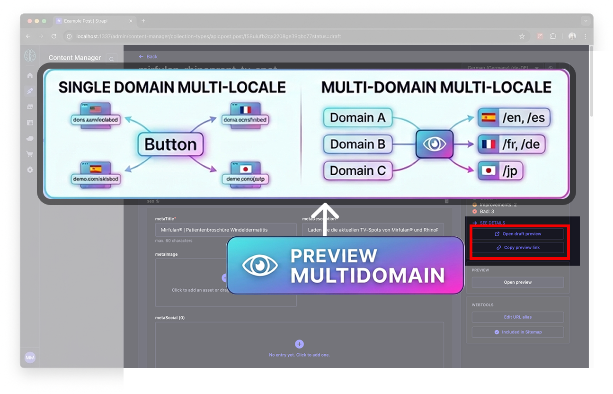

<div align="center">
    
    <h1>Strapi Preview Button Multidomain</h1>
    <p>A plugin for Strapi CMS that adds a preview button and live view button to the content manager edit view multi domain and multi locals.</p>
    <p>
      <a href="https://www.npmjs.com/package/preview-button-multidomain">
        
      </a>
      <a href="https://strapi.io">
        
      </a>
    </p>
    
  </div>
  
# preview-button-multidomain

**[strapi-plugin-preview-button](https://www.npmjs.com/package/strapi-plugin-preview-button)**, extended for **multiple domains and locales**.

Keep using [strapi-plugin-preview-button](https://www.npmjs.com/package/strapi-plugin-preview-button) for Open draft preview / Copy link / live view. This package plugs into its `plugin/preview-button/before-build-url` hook so each entry’s **locale** (and optional slug) maps to the right frontend **host** — one domain for many locales, or a different domain per locale — by substituting `{host}` in your URL templates.

**Depends on:** [`strapi-plugin-preview-button@^3`](https://www.npmjs.com/package/strapi-plugin-preview-button) (required peer; this package does **not** replace it).  
**Upstream source:** [mattmilburn/strapi-plugin-preview-button](https://github.com/mattmilburn/strapi-plugin-preview-button)

## Features

- Extends [strapi-plugin-preview-button](https://www.npmjs.com/package/strapi-plugin-preview-button) — same buttons, multi-domain / multi-locale hosts
- Map **locales** (and slugs) → frontend hosts via configurable `domains[]`
- One host for several locales, or separate hosts per locale/market
- Exact `.env` keys on `domains[].env` (no auto-prefix)
- Optional `defaultEnv` when locale/slug do not match
- Locale match first, then slug (slug can override); null-safe `{host}` replace
- Single consumer config: `contentTypes` on this plugin, mirrored onto `preview-button` at bootstrap
- Bundler-safe: server resolves env → URLs; admin fetches public config

## Prerequisites

- Strapi 5.x
- **[strapi-plugin-preview-button](https://www.npmjs.com/package/strapi-plugin-preview-button)** `@^3` installed **and** enabled (`'preview-button': true`)

Install and enable [strapi-plugin-preview-button](https://www.npmjs.com/package/strapi-plugin-preview-button) first. This extender only chooses the host; without upstream, there are no preview buttons. Peer install does **not** auto-enable it in Strapi — both plugins must appear in `config/plugins`.

## Install

Beta (current):

```bash
npm install preview-button-multidomain@beta strapi-plugin-preview-button@^3
```

Or pin: `preview-button-multidomain@1.0.0-beta.0`.

Source and issues: [github.com/BrainStation-23/strapi-preview-multidomain-plugin](https://github.com/BrainStation-23/strapi-preview-multidomain-plugin). Releases: [GitHub Releases](https://github.com/BrainStation-23/strapi-preview-multidomain-plugin/releases/new).

## Configure `config/plugins`

### 1. Primary example

Mix patterns in one `domains` list: **one host for several languages** (DACH), plus **another host** for English.

| URL part | Who covers it |
| --- | --- |
| Host | **This plugin** — `{host}` from the matched `domains` row |
| Path prefix (`/de_DE/`, `/de_AT/`, …) | **Not this plugin** — `{localePath}` (or another mapped entry field) in the template |
| Page slug | **Upstream** `preview-button` via `{slug}` |

```js
// config/plugins.ts
export default ({ env }) => ({
  'preview-button-multidomain': {
    enabled: true,
    config: {
      domains: [
        {
          env: 'STRAPI_ADMIN_DOMAIN_DACH',
          locales: ['de-DE', 'de-AT', 'de-CH'],
          // host matching only — does NOT insert /de_AT/ into the URL
          slugs: ['de_DE', 'de_AT', 'de_CH'],
        },
        {
          env: 'STRAPI_ADMIN_DOMAIN_ENGLISH_1',
          locales: ['en-GB'],
          slugs: ['en'],
        },
      ],
      defaultEnv: 'STRAPI_ADMIN_DOMAIN_DACH',
      contentTypes: [
        {
          uid: 'api::page.page',
          draft: {
            // {host} = this plugin; {localePath}/{slug} = upstream/entry fields
            url: `{host}/{localePath}/{slug}?secret=${env('PREVIEW_SECRET')}&status=draft`,
          },
          published: {
            url: `{host}/{localePath}/{slug}`,
          },
        },
      ],
    },
  },

  // Required — npm dependency does not auto-enable Strapi plugins
  'preview-button': true,
});
```

```bash
STRAPI_ADMIN_DOMAIN_DACH=https://mydomain.com
STRAPI_ADMIN_DOMAIN_ENGLISH_1=https://english.example.com
PREVIEW_SECRET=your-preview-secret
```

Prefer `STRAPI_ADMIN_*` for admin-related hosts. There is **no** auto-prefix: `env` is the exact `process.env` key.

This plugin does **not** auto-convert `de-AT` → `/de_AT/`.

**Single locale, single slug** (one language → one host):

```js
{
  env: 'STRAPI_ADMIN_DOMAIN_GERMAN',
  locales: ['de-DE'],
  slugs: ['de_DE'],
},
```

### 2. More hosts (optional)

Add more rows the same way — each `env` is a different host:

```js
domains: [
  {
    env: 'STRAPI_ADMIN_DOMAIN_DACH',
    locales: ['de-DE', 'de-AT', 'de-CH'],
    slugs: ['de_DE', 'de_AT', 'de_CH'],
  },
  {
    env: 'STRAPI_ADMIN_DOMAIN_ENGLISH_1',
    locales: ['en-GB'],
    slugs: ['en'],
  },
  {
    env: 'STRAPI_ADMIN_DOMAIN_FRENCH',
    locales: ['fr', 'fr-FR'],
    slugs: ['fr'],
  },
],
defaultEnv: 'STRAPI_ADMIN_DOMAIN_DEFAULT',
```

```bash
STRAPI_ADMIN_DOMAIN_DACH=https://mydomain.com
STRAPI_ADMIN_DOMAIN_ENGLISH_1=https://english.example.com
STRAPI_ADMIN_DOMAIN_FRENCH=https://french.example.com
STRAPI_ADMIN_DOMAIN_DEFAULT=https://www.example.com
```

### Resolution rules

1. Match `data.locale` against `domains[].locales`
2. Then match `data.slug` against `domains[].slugs` (slug can override; host matching only — does not write path prefixes)
3. Else use `defaultEnv` URL when set
4. Missing env values are skipped (domain omitted); unmatched entries do not inject `undefined` into URLs

### Dual-config fallback

If extender `contentTypes` is empty, contentTypes already configured on `preview-button` still work. Prefer the single extender config above.

## Migration from `preview-button-before-build`

1. Replace package / plugin key with `preview-button-multidomain`
2. Move host selection into `config.domains` (+ `defaultEnv`) instead of hard-coded DE/AT/CH envs
3. Move `contentTypes` onto this plugin’s `config` (optional but recommended)
4. Keep `'preview-button': true`

## Develop

```bash
npm run build
npm run verify
npm test
```

## Links

| | |
| --- | --- |
| **Required dependency (npm)** | [strapi-plugin-preview-button](https://www.npmjs.com/package/strapi-plugin-preview-button) (`^3`) |
| Upstream source | [mattmilburn/strapi-plugin-preview-button](https://github.com/mattmilburn/strapi-plugin-preview-button) |
| Issues | https://github.com/BrainStation-23/strapi-preview-multidomain-plugin/issues |

---

**Organization:** [BrainStation-23](https://github.com/BrainStation-23)  
**Author:** Abu Sayed ([Sayedbs](https://github.com/sayed021) / `sayed021`)  
**Repository:** [BrainStation-23/strapi-preview-multidomain-plugin](https://github.com/BrainStation-23/strapi-preview-multidomain-plugin)  
**Release notes:** [RELEASE.md](./RELEASE.md)
